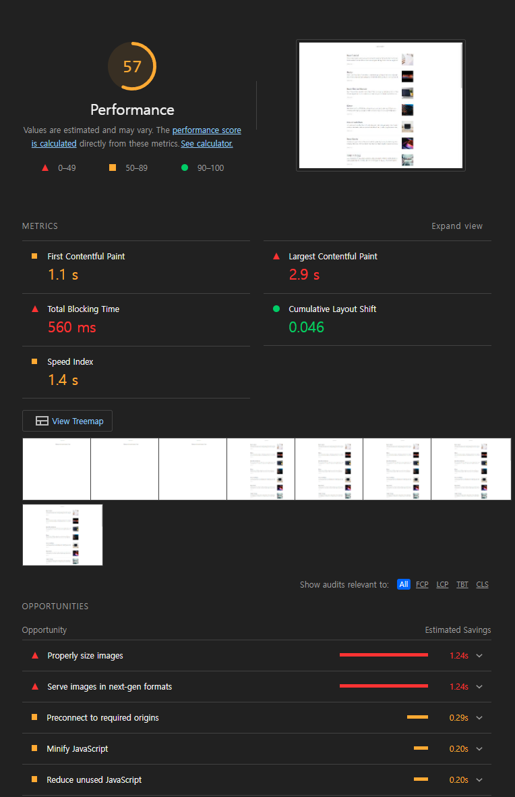

# Lecture-1

## 성능 최적화의 필요성

페이지 로딩 속도와 이탈률 및 전환율이 연관이 되어있다. 페이지 표시 시간이 늘어나게되면 이탈률 또한 증가하게 된다.
핀터레스트는 로딩시간을 40% 줄여 검색 유입률과 가입자 수를 15% 늘렸다. COOK은 평균 페이지 로드 시간을 850 밀리초로 줄여 세션당 페이지 조회수를 10% 늘렸고 이탈률은 7% 감소시켰다.

## 성능을 결정하는 요소

### 로딩 성능

로딩 성능은 서버에 있는 웹 페이지와 리소스를 다운로드할 때 성능을 말한다.

-   로딩성능을 개선하는 방법
    -   리소스 수를 줄임
    -   크기를 줄임
    -   코드를 분할
    -   리소스의 우선순위에 따라 중요한 리소스 먼저 다운로드

### 렌더링 성능

다운로드한 리소스를 가지고 화면에 그릴 때의 성능.
자바스크립트 코드를 효율적으로 작성해야 화면이 그려지는 속도와 사용자 인터랙션의 자연스러운 정도가 달라진다.
렌더링 성능을 개선하는 방법은 아주 다양하므로 브라우저 동작원리나 사용하는 프레임워크의 라이프 사이클을 이해하고 있어야 서비스에 맞는 성능 최적화가 가능해진다.

## 학습할 최적화 기법

### 이미지 사이즈 촤적화

너무 큰 사이즈의 이미지를 사용하게 되면 네트워크 트래픽이 증가해 서비스 로딩이 오래걸리게 된다.
하지만 화질때문에 무작정 잘게 만들 수 없다.

### 코드 분할

첫 페이지 진입할 때 당장 사용되지 않는 코드는 떼어내서 필요한 때에 따로 로드할 수 있다.

### 텍스트 압축

다운로드 전에 서버에서 미리 압축하면 더 작은 사이즈로 클라이언트에서 다운로드할 수 있기 때문에 웹 페이지가 더 빠르게 로드된다.

### 병목 코드 최적화

특정 자바스크립트 코드가 서비스가 느리게 다운로드되거나 느리게 실행되는 경우가 있음 서비스를 느리게 만드는 코드를 병목 코드라고 함 이를 찾아내고 최적화해야한다.

### 분석 툴 소개

1. 크롬 개발자 도구 - 크롬 브라우저에서 제공하는 웹 개발에 도움되는 툴
2. 크롬 개발자 도구 Network 패널 - 현재 웹 페이지에서 발생하는 모든 네트워크 트래픽을 상세하게 알려줌
3. 크롬 개발자 도구 Performance 패널 - 웹 페이지가 로드될 때, 실행되는 모든 작업을 보여줌network 패널에서 봤던 리소스가 로드되는 타이밍, 브라우저의 메인 스레드에서 실행되는 자바스크립트를 차트 형태로 볼 수 있음 이를 통해 어떤 자바스크립트 코드가 느린지 확인할 수 있음
4. 크롬 개발자 도구의 Lighthouse 패널 - 구글에서 만든 툴로 웹사이트 성능을 측정하고 개선 방향을 제시해주는 자동화 툴 lighthouse를 이용해 웹사이트 성능 점수를측정하고 개선 가이드를 확인함으로써 어떤 부분을 중점적으로 분석하고 최적화해야하는지 알 수 있음
5. webpack-bundle-analyzer - webpack을 통해 번들링된 파일이 어떤 코드, 즉 어떤 라이브버리를 담고 있는지 보여줌

## Lighthouse

Mode

-   Navigation: 기본값, 초기 페이지 로딩 시 발생하는 성능 문제를 분석
-   Timespan: 사용자가 정의한 시간 동안 발생한 성능 문제를 분석
-   Snapshot: 현재 상태의 성능 문제를 분석

Categories

-   Performance: 웹 페이지의 로딩 과정에서 발생하는 성능 문제를 분석
-   Accessibility: 서비스의 사용자 접근성 문제를 분석
-   Best practices: 보안 측면과 웹 개발 최신 표준에 중점을 두고 분석
-   SEO: 검색 엔진에서 얼마나 잘 크롤링되고 검색 결과에 표시되는지 분석
-   Progressive Web App: 서비스 워커와 오프라인 동작 등, PWA와 관련된 문제를 분석

### Webvitals

### FCP(First Contentful Paint)

페이지가 로드될 때 브라우저가 DOM 콘텐츠의 첫 번째 부분을 렌더링하는 데 걸리는 시간에 관한 지표. 총점 계산 시 10%의 가중치.

### SI(Speed Index)

페이지 로드 중에 콘텐츠가 시각적으로 표시되는 속도를 나타내는 지표. 총점 계산이 10%의 가중치.

### LCP(Largest Contentful Paint)

LCP는 페이지가 로드될 떄 화면 내에 있는 가장 큰 이미지나 텍스트 요소가 렌더링되기까지 걸리는 시간. 25%의 가중치.

### TTI(Time to Interactive)

TTI는 사용자가 페이지와 상호 작용이 가능한 시점까지 걸리는 시간 측정. 10%의 가중치.

### TBT(Total Blocking Time)

TBT는 페이지가 클릭, 키보드 입력 등의 사용자 입력에 응답하지 않도록 차단된 시간을 총합한 지표. FCP와 TTI 사이 시간동안 일어나며 메인 스레드를 독점하여 다른 동작을 방해하는 작업에 걸린 시간을 총합. 30%의 가중치.

### CLS(Cumulative Layout Shift)

페이지 로드 과정에서 발생하는 예기치 못한 레이아웃 이동을 측정한 지표. 레이아웃 이동이란 화면상에서 요소의 위치나 크기가 순간적으로 변하는 것을 말함. 15%의 가중치.

## 이미지 사이즈 최적화

너비 기준으로 두배 정도 큰 이미지를 사용하는 것이 적절함.

실제 120 _ 120으로 사용되고 있는 이미지를 원본 사이즈인 1200 _ 1200 으로 가져오는 대신 240 \* 240으로 가져옴


### 이미지 CDN

CDN(Contetn Delivery Network)란 물리적 거리의 한계를 극복하기 위해 사용자와 가까운 곳에 서버를 두는 기술을 의미한다.

이미지 CDN은 이미지에 특화된 것으로 기본적인 CDN의 기능과 더불어 이미지를 사용자에게 보내기 전에 특정 형태로 가공하여 전해주는 기능까지 있다.  (사이즈 조절, 특정 포맷으로 변경)

이미지 url에 쿼리스트링으로 width, height를 명시해준다.

### 이미지 사이즈 최적화 전



아래 Opportunity에 Properly size images 항목이 있는 것을 볼 수 있다. 


실제 렌더링 되는 사이즈는 120 * 120이기 때문에 이를 변경해주기로 한다. 

```jsx
function Article(props) {
  const createdTime = new Date(props.createdTime)
  return (
    <div className={'Article'}>
      <div className={'Article__summary'}>
        <div className={'Article__summary__title'}>{props.title}</div>
        <div className={'Article__summary__desc'}>{removeSpecialCharacter(props.content)}</div>
        <div className={'Article__summary__etc'}>
          {createdTime.getFullYear() +
            '.' +
            zeroPad(createdTime.getMonth() + 1, 2) +
            '.' +
            zeroPad(createdTime.getDate(), 2)}
        </div>
      </div>
      <div className={'Article__thumbnail'}>
        
      </div>
    </div>
  )
}

export default Article
```

### 최적화 후


Opportunity에서 사이즈 조절하라는 부분이 없어졌으며, 성능 점수 또한 올랐다. 

## 병목 코드 최적화

### Performance 패널

Reduce unused Javascript 항목이 opportunity에 명시되어있는 것을 확인할 수 있다. 


더 자세히 알아보기 위해서 메인스레드의 작업을 상세하게 살펴보고 느린 작업이 무엇인지 확인하기 위해 Performance 패널을 활용할 수 있다.


### 1. CPU 차트, Network 차트, 스크린샷

CPU 차트는 시간에 따라 CPU가 어떤 작업에 리소스를 사용하고 있는지 비율로 보여준다. 

- 노란색 - 자바스크립트 실행 작업1
- 보라색 - 렌더링/레이아웃 작업
- 초록색 - 페인팅 작업
- 회색 - 기타 시스템 작업
- 빨간색 - 병목이 발생하는 지점, 메인 스레드를 오랫동안 잡아주고 있다는 뜻이다.

네트워크 차트는 CPU 차트 밑에 막대 형태로 표시되고, 대력적인 네트워크 상태를 보여주며, 위쪽의 진한 막대는 우선순위가 높은 리소스를, 옅은 막대는 우선순위가 낮은 네트워크 리소스를 나타낸다. 

스크린샷 리스트는 서비스가 로드되는 과정을 보여준다.

### 2. Network 타임라인

Network 패널과 유사하게 서비스 로드 과정에서의 네트워크 요청을 시간 순서에 따라 보여준다. 

- 왼쪽 회색 선: 초기 연결 시간
- 막대의 옅은 색 영역: 요청을 보낸 시점부터 응답을 기다리는 시점까지의 시간 (TTTB)
- 막대의 짙은 색 영역: 콘텐츠 다운로드 시간
- 오른쪽 회색 선: 해당 요청에 대한 메인 스레드의 작업 시간

### 3. Frames, Timings, Main

Frame 섹션은 화면의 변화가 있을 때마다 스크린샷을 찍어 보여준다. 

Timings 섹션은 User Timing API를 통해 기록된 정보를 기록한다. 

Main 섹션은 브라우저의 메인 스레드에서 실행되는 작업을 플레임 차트로 보여준다. 

### 4. 하단 탭

Summary, Bottom-up, Call Tree, Event log 탭에서 전체 또는 선택된 영역에 대한 상세 내용을 확인할 수 있다. 

Summary 탭은 선택 영역에서 발생한 작업 시간의 총합과 각 작업이 차지하는 비중을 보여준다. 

Bottom-up은 가장 최하위에 있는 작업부터 상위 작업까지 역순으로 보여준다. 

Call Tree탭은 Bottom-up과 반대로 최하위부터 상위 작업까지 보여준다. 

Event log 탭은 발생한 Event를 보여준다. - Loading, Experience, Scripting, Rendering, Painting

## 페이지 로드과정

1. HTML 파일 다운로드 후 파싱


1. 자바스크립트 다운로드 완료 후 실행
    
    
    
    자바스크립트가 실행되면서 컴포넌트들이 하나씩 실행되는 것을 확인할 수 있다. 
    
    1. 병목코드찾기
    
    
    
    
    
    다른 컴포넌트의 렌더링에는 80~100ms밖에 안걸리지만 Article의 경우에는 그 4배가 걸리는 것을 확인할 수 있다. 
    

## 병목 코드 최적화

Article 컴포넌트에서 사용되는 removeSpecialCharacter함수가 성능을 떨어뜨리는 원인임을 감지하고 코드를 변경해보았다. 

```jsx
function removeSpecialCharacter(str) {
  const removeCharacters = ['#', '_', '*', '~', '&', ';', '!', '[', ']', '`', '>', '\n', '=', '-']
  let _str = str
  let i = 0,
    j = 0

  for (i = 0; i < removeCharacters.length; i++) {
    j = 0
    while (j < _str.length) {
      if (_str[j] === removeCharacters[i]) {
        _str = _str.substring(0, j).concat(_str.substring(j + 1))
        continue
      }
      j++
    }
  }

  return _str
}
```

기존 코드는 위와 같다. 특수 문자 하나하나마다 반복문을 돌려 체크하는 것이 비효율적으로 판단된다. 블로그 글 데이터를 모두 체크하는 것이 아니라 300자 정도만 잘라서 확인하고,  replace 함수를 사용해 효율적으로 특수 문자를 제거하였다. 

```jsx
function removeSpecialCharacter(str) {
  let _str = str.substring(0, 300)
  _str = _str.replace(/[#_*~&;![\]`>\n=\->]/g, '');
  return _str
}
```

### 최적화 전


### 최적화 후


전체 Task가  552.44ms 걸리던 것에서 14.98ms가 걸렸다. 아주 유의미한 차이를 보여준다. 

## 코드 분할 & 지연 로딩


### webpack-bundle-analyzer로 번들 파일 분석

번들 파일이 어떤 코드로 이루어져있는지 파악해서 어떤 코드가 크기가 커서 다운로드가 오래 걸리는지 파악할 수 있다. 


이게 제일 큰 번들이다. refractor와 react-dom으로 이루어져있는데, 이는 리액트를 위한 것이므로 제외하고 refractor를 찾아본다. 


react syntax highlighter에서 refractor를 의존성으로 가지고 있는 것을 확인할 수 있다. 

이는 블로그 내용 안의 코드블록에서 사용되는 것이므로 목록 페이지에서는 필요없다. 따라서 페이지 별로 분리해 따로 로드하는 것이 좋다고 판단된다. 

코드 분할이란 말그대로 코드를 분할하는 기법으로 하나의 번들 파일을 여러 개의 파일로 쪼개는 방법이다. 분할된 코드를 해당 코드가 필요한 시점에 로딩하도록 만드는 지연 로딩을 해서 최적화를 진행한다. 

## 코드 분할 하기

```jsx
import React from 'react'
import { Switch, Route } from 'react-router-dom'
import './App.css'
import ListPage from './pages/ListPage/index'
import ViewPage from './pages/ViewPage/index'

function App() {
  return (
    <div className="App">
      <Switch>
        <Route path="/" component={ListPage} exact />
        <Route path="/view/:id" component={ViewPage} exact />
      </Switch>
    </div>
  )
}

export default App
```

```jsx
import React, { Suspense } from 'react'
import { Switch, Route } from 'react-router-dom'
import './App.css'
const ListPage = React.lazy(() => import('./pages/ListPage/index'));
const ViewPage = React.lazy(() => import('./pages/ViewPage/index'));

function App() {
  return (
    <div className="App">
      <Suspense fallback={<div>로딩중..</div>}>
        <Switch>
          <Route path="/" component={ListPage} exact />
          <Route path="/view/:id" component={ViewPage} exact />
        </Switch>
      </Suspense>
    </div>
  )
}

export default App
```

동적 import를 사용해 런타임에 모듈을 가져오도록 할 수 있다. 이 때 webpack은 동적 import 구문을 Promise 형태로 모듈을 반환하는데, 여기서 컴포넌트를 추출하기 위해 React의 lazy 함수와 Suspense를 적절하게 사용할 수 있다. 비동기 문제를 신경 쓰지 않고도 동적 import 가 가능해진다. 


여러 번들로 쪼개진 모습을 확인할 수 있다. 

## 텍스트 압축

### production 환경과 development 환경

production 환경일 때는 webpack에서 경량화, 난독화 같은 추가적인 최적화 작업을 하므로 최종 서비스 성능을 측정할 때는 실제 사용자에게 제공되는 production 환경으로 빌드된 서비스의 성능을 측정해야한다. 

블로그 목록이 아닌 글 페이지의 성능을 측정해보면 Opportunity에 Enable text compression을 제안하고 있다. 


웹 페이지를 로드할 때 다양한 리소스를 다운로드하는데, 이런 리소스를 다운로드할 때 파일 크기가 클수록 로딩이 완료되는 데 오래 걸린다. 따라서 코드 분할이나 텍스트 압축 기법을 사용해 리소스를 줄일 수 있게 된다. 

압축 여부는 HTTP 헤더를 살펴보면된다. 블로그 글 API의 경우 압축된 것으로 response를 주기 때문에, Content-Encoding의 값으로 gzip으로 명시되어있는 것을 확인할 수 있다. 


압축 방식은 Gzip과 Deflate가 있다. 

### 텍스트 압축 적용

```jsx
"scripts": {
    "start": "react-scripts start",
    "build": "react-scripts build",
    "serve": "npm run build && node ./node_modules/serve/bin/serve.js -u -s build",
    "server": "node ./node_modules/json-server/lib/cli/bin.js --watch ./server/database.json -c ./server/config.json"
  },
```

package.json에서 serve 스크립트를 실행하면 명령어를 확인했을 때 압축을 하지않겠다를 의미하는 ‘-u’ 플래그를 없애준다. 


압축이 잘 되어진 것을 확인할 수 있고,  블로그 글 목록의 성능을 다시 측정했을 때, Enable text compression 부분이 사라진 것을 확인할 수 있다. 

